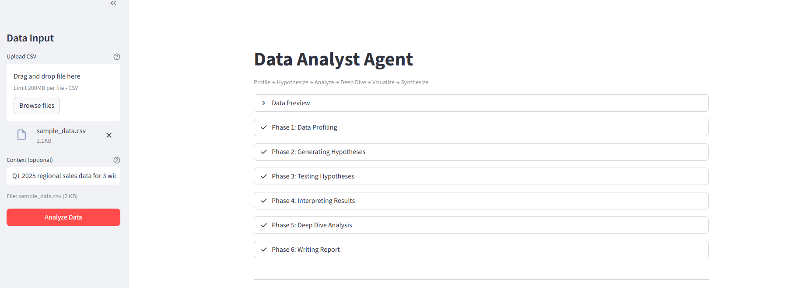
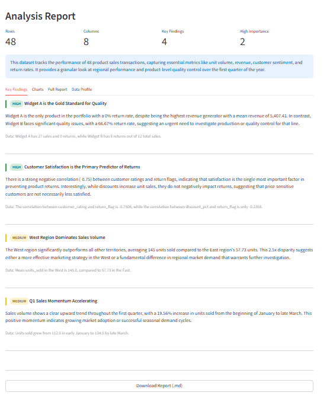
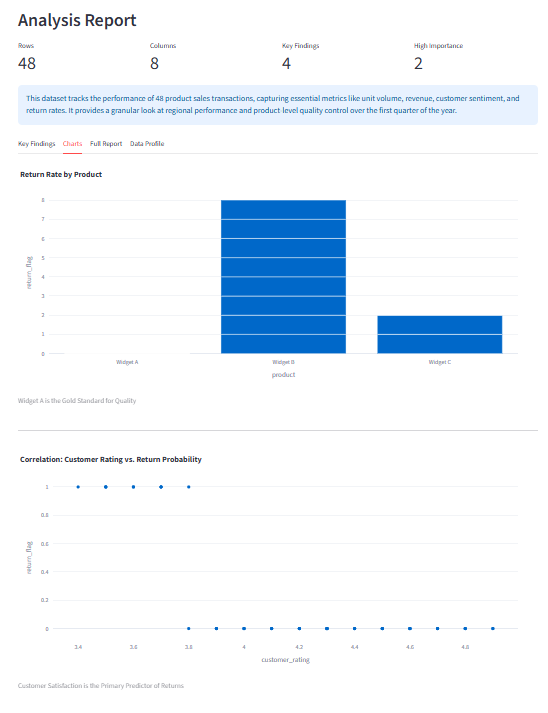

# Data Analyst Agent

An autonomous data analysis agent. Upload a CSV and the agent profiles it, forms hypotheses about what's interesting, tests them using a predefined analysis toolkit, deep-dives into the most important findings, generates charts, and writes a narrative report. You don't tell it what to analyze -- it decides.

<p align="center">
  
</p>

<p align="center">
  
</p>

<p align="center">
  
</p>

## The Problem

You have a CSV full of data. You could spend hours writing pandas code, testing hypotheses, and making charts. Or you could upload it and let an agent do the exploration for you -- including figuring out what's worth exploring.

## What This Agent Does

You upload a CSV file. The agent:

1. **Profiles** the data -- column types, distributions, missing values, basic stats (deterministic, no LLM)
2. **Hypothesizes** -- based on the profile, generates 4-6 hypotheses about what patterns might exist ("Do regions differ significantly?", "Is there a seasonal trend?", "Are there outliers in revenue?")
3. **Analyzes** -- tests each hypothesis using a predefined analysis toolkit (correlation, group comparison, outlier detection, time trends, etc.). The LLM selects which tools to use and with which parameters
4. **Interprets** -- evaluates the results, ranks findings by interestingness/importance
5. **Deep Dives** -- picks the top 2 most interesting findings and runs deeper analysis (e.g., segmenting by another dimension, checking if patterns hold across subgroups)
6. **Visualizes** -- generates Plotly charts for key findings
7. **Synthesizes** -- writes a narrative report connecting findings into a data story

## User Flow

1. Open the app, upload a CSV in the sidebar
2. Optionally add context ("this is sales data from 2023")
3. Hit "Analyze Data"
4. Watch the 6-phase pipeline: profiling, hypothesis generation, analysis, interpretation, deep dive, synthesis
5. Review results across 4 tabs: Key Findings (with importance badges), Charts (interactive Plotly), Full Report (narrative), Data Profile (column stats)
6. Download the report as markdown

## What Makes This an Agent (Not a Wrapper)

- **The agent DECIDES what to analyze.** You just upload data.
- **Hypothesis-driven**: It doesn't just compute everything -- it forms specific hypotheses and tests them
- **Prioritization**: Findings are ranked by interestingness. High-importance findings get deep dives.
- **Selective deep dive**: Only the top 2 findings get deeper analysis, based on the agent's judgment
- **Safe execution**: No LLM-generated code runs. The LLM selects from 10 predefined analysis tools and specifies parameters. The toolkit validates and executes.

## Setup

```bash
cd agents/data_analyst_agent
pip install -r requirements.txt
```

Create a `.env` file:
```
GEMINI_API_KEY=your_key_here
```

Run:
```bash
streamlit run app.py
```

## Tech Stack

- **LLM**: Gemini 2.5 Flash Lite (hypothesis generation, interpretation, synthesis)
- **Data Analysis**: pandas + numpy (predefined toolkit, no arbitrary code execution)
- **Visualization**: Plotly Express (7 chart types)
- **UI**: Streamlit with file uploader, interactive charts, progress display
- **Data Models**: Pydantic for structured validation at every boundary

## Handles Messy Data

- Auto-detects delimiters (comma, tab, semicolon, etc.)
- UTF-8 and Latin-1 encoding support
- Smart type inference (tries numeric, then datetime, then categorical)
- Handles missing values gracefully (per-operation dropna, not global)
- Samples large datasets (>50K rows) for performance
- Skips bad lines instead of crashing

## No Additional API Keys

Only needs your Gemini API key. No external data APIs -- all analysis runs locally on the uploaded data.
