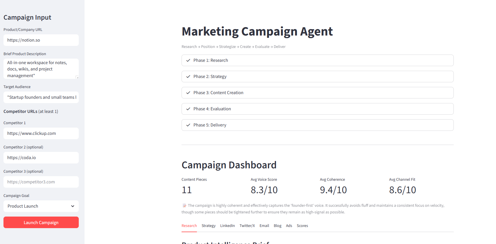
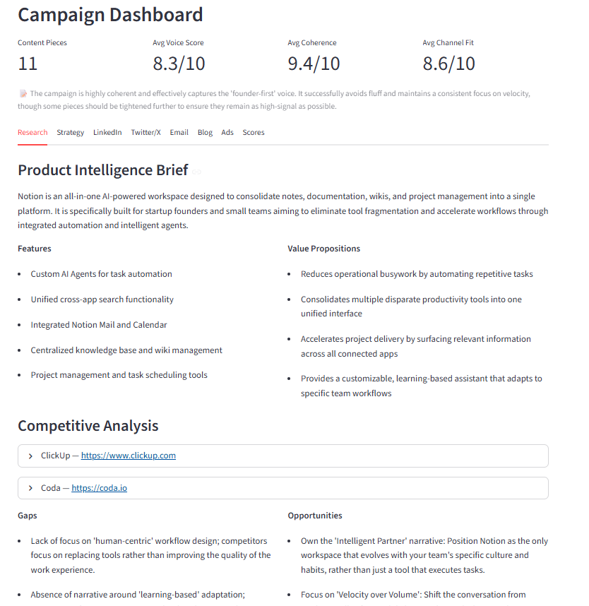
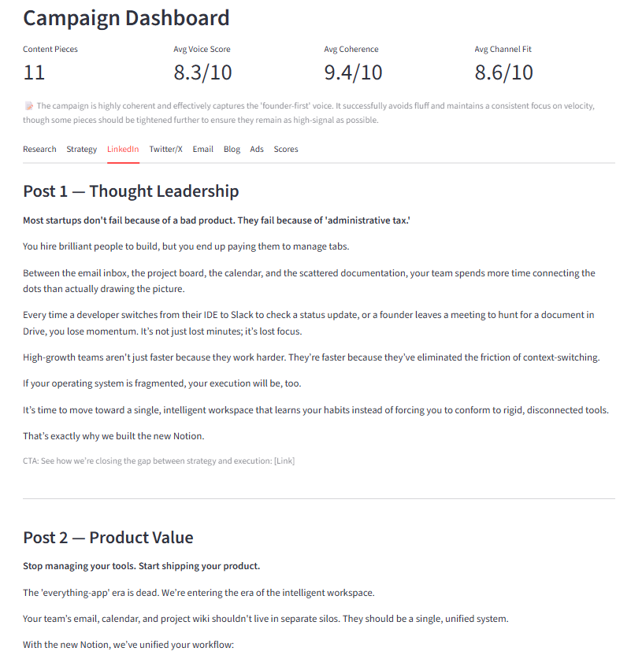

# Marketing Campaign Agent

## What Is This?

You give it a product URL and a target audience. It gives you back a complete, coherent marketing campaign — not random copy, but a researched, strategized, multi-channel content package.

<p align="center">
  
</p>

<p align="center">
  
</p>

<p align="center">
  
</p>

Most AI marketing tools are glorified prompt wrappers: "write me a LinkedIn post." That's not marketing. Real marketing is research-driven, strategically planned, and consistent across every touchpoint. This agent does what a marketing strategist does — it just does it in minutes.

## The Problem

Creating a marketing campaign the right way requires:
- Deep product understanding (not surface-level)
- Competitor awareness (what's already being said)
- Clear brand positioning (why YOU, why NOW)
- Multi-channel content that tells ONE coherent story
- Quality control across every piece

Solo founders, small teams, and even marketing professionals spend days on this. Most skip the research and strategy steps entirely and jump straight to writing — which is why most content sounds generic.

## The Solution

An agent that follows the full marketing workflow end-to-end:

**Research → Position → Strategize → Create → Evaluate → Deliver**

Not a chatbot. Not a form that generates copy. An autonomous agent that:
- Scrapes and analyzes your product from its actual website
- Researches your competitors from their actual websites
- Builds brand positioning based on real competitive gaps
- Plans a campaign strategy before writing a single word
- Creates content for every channel with consistent voice
- Self-evaluates and refines before delivering

## User Flow

### Step 1: Input (30 seconds)
User provides:
- **Product/Company URL** — the agent will scrape and analyze this
- **Brief product description** — a 1-2 sentence backup/supplement
- **Target audience** — who are we talking to (e.g., "startup CTOs", "fitness-conscious millennials")
- **2-3 Competitor URLs** — the agent will analyze these too
- **Campaign goal** — what's the objective (launch, awareness, lead gen, etc.)

### Step 2: Research Phase (Agent works autonomously)
The agent:
1. **Scrapes the product URL** — extracts value propositions, features, messaging, tone
2. **Scrapes competitor URLs** — extracts their positioning, messaging, strengths
3. **Builds a Product Intelligence Brief** — structured summary of what the product does, who it's for, key differentiators
4. **Builds a Competitive Analysis** — what competitors say, gaps in their messaging, opportunities

The user sees this research happening in real-time with status updates.

### Step 3: Strategy Phase (Agent works autonomously)
Based on research, the agent:
1. **Develops Brand Positioning** — the unique angle that separates this product from competitors
2. **Creates a Brand Voice Guide** — tone, personality, do's and don'ts for all content
3. **Plans Campaign Architecture** — which channels, what sequence, how pieces connect

The user sees the strategy being built and can review it.

### Step 4: Content Creation Phase (Agent works autonomously)
The agent creates a full campaign package:

| Channel | What Gets Created |
|---------|-------------------|
| **LinkedIn** | 3 posts (thought leadership, product value, social proof angle) |
| **Twitter/X** | 1 tweet thread (5-7 tweets telling the product story) |
| **Email** | 3-email nurture sequence (hook → value → CTA) |
| **Blog** | 1 full blog post outline with key talking points per section |
| **Ad Copy** | 3 variations of short-form ad copy (headline + body + CTA) |

Each piece is created by a specialized worker, guided by the brand voice guide and campaign strategy.

### Step 5: Evaluation Phase (Agent works autonomously)
An evaluator reviews every content piece against:
- **Brand voice consistency** — does it match the voice guide?
- **Campaign coherence** — does it tell the same story as other pieces?
- **Channel fit** — is it optimized for the specific platform?
- **Quality score** — overall rating with specific feedback

Pieces that score below threshold get automatically revised.

### Step 6: Delivery
The user receives:
- **Campaign Dashboard** — overview of everything generated, with quality scores
- **Product Intelligence Brief** — the research summary
- **Competitive Analysis** — what the agent found
- **Brand Positioning & Voice Guide** — the strategic foundation
- **All Content Pieces** — organized by channel, ready to use
- **Download option** — export everything as a packaged file

## What Makes This Truly Agentic

| Feature | Prompt Wrapper | This Agent |
|---------|---------------|------------|
| Product understanding | User describes it | Agent scrapes and analyzes the actual website |
| Competitor awareness | None | Agent researches real competitors |
| Strategy | None | Agent builds positioning and voice before writing |
| Content creation | One piece at a time | Full multi-channel campaign as a coherent package |
| Quality control | None | Self-evaluation loop with automatic revision |
| Consistency | Random per piece | Brand voice guide enforced across all content |

## Tech Stack
- **LLM**: Google Gemini 3.1 Flash Lite — fast, capable, cost-effective for multi-step agent work
- **UI**: Streamlit — rapid prototyping, real-time status updates
- **Web Scraping**: BeautifulSoup + requests — lightweight product/competitor research
- **Architecture**: Orchestrator-Worker pattern with Evaluator-Optimizer loop
- **Export**: JSON/Markdown campaign package

## Setup

```bash
cd agents/marketing_agent
pip install -r requirements.txt
cp .env.example .env
# Add your Gemini API key to .env
streamlit run app.py
```

## Required API Keys
- `GEMINI_API_KEY` — Google Gemini API key ([Get one here](https://aistudio.google.com/apikey))
