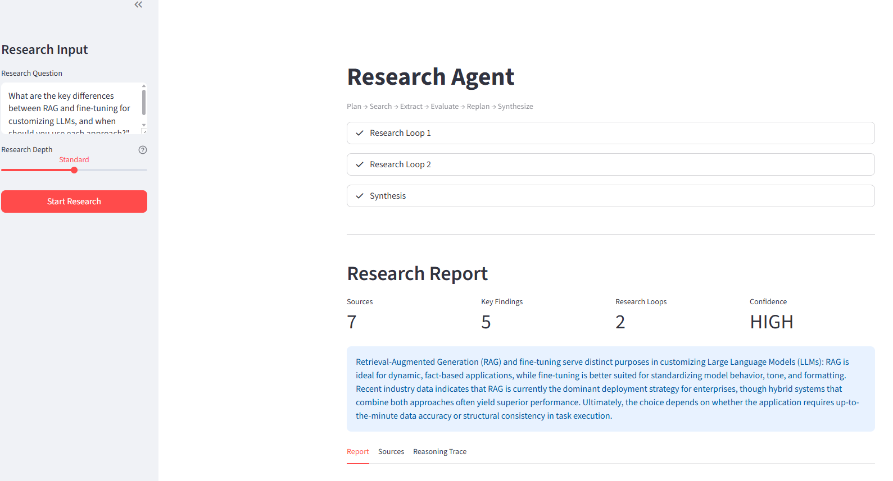
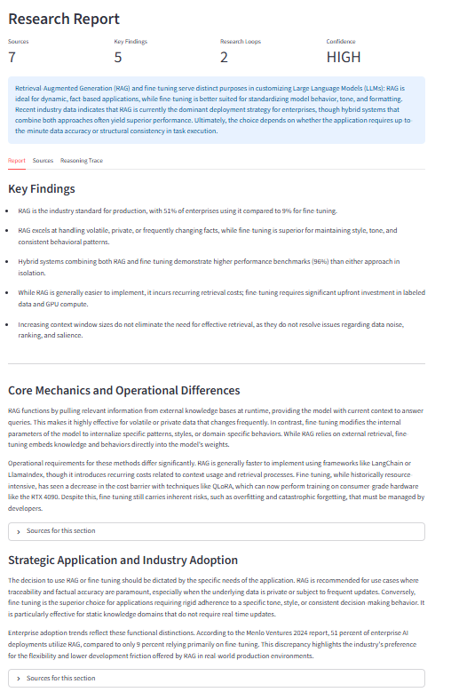

# Research Agent

An autonomous research agent that takes a question, breaks it into sub-queries, searches the web, extracts facts, evaluates coverage, replans to fill gaps, and synthesizes a comprehensive cited report. The agent decides what to search, when to stop, and how to structure the answer.

<p align="center">
  
</p>

<p align="center">
  
</p>

## The Problem

Researching a complex topic means searching for multiple angles, cross-referencing sources, identifying what's still missing, and synthesizing findings into something coherent. A single Google search and skim doesn't cut it for real research.

## What This Agent Does

You ask a question. The agent:

1. **Plans** -- breaks your question into 3 targeted search queries, each covering a different angle
2. **Searches** -- runs each query through DuckDuckGo and scrapes the top results for full content
3. **Extracts** -- pulls specific, verifiable facts from each source with confidence ratings
4. **Evaluates** -- scores its own coverage (1-10) and identifies what's still missing
5. **Replans** -- designs new searches that specifically target the gaps it found
6. **Loops** -- repeats steps 2-5 until coverage is sufficient or max depth is reached
7. **Synthesizes** -- writes a structured report with sections, key findings, and source citations

The key: the second round of searches is informed by what the first round found. The agent doesn't just search 3 times -- it builds on its own knowledge.

## User Flow

1. Open the app, type your research question in the sidebar
2. Choose research depth: Quick (2 loops), Standard (3), or Deep (4)
3. Hit "Start Research"
4. Watch the live reasoning trace: see what the agent searches, what facts it finds, what gaps it identifies, and why it searches again
5. Get a structured report with executive summary, sections, key findings, and full source citations
6. Download the report as markdown

## What Makes This Truly Agentic

- **Autonomous search planning**: The agent decides what to search. You just ask the question.
- **Self-evaluation**: The agent scores its own coverage and identifies specific gaps -- not a fixed number of searches.
- **Adaptive replanning**: Each search round targets gaps from the previous round. The second search is always different from the first.
- **Convergence decision**: The agent decides when it has enough information. Coverage score >= 8 or the evaluator says "further searching unlikely to help."
- **Visible reasoning**: Every decision is logged and shown in the UI.

## Setup

```bash
cd agents/research_agent
pip install -r requirements.txt
```

Create a `.env` file:
```
GEMINI_API_KEY=your_key_here
```

Run:
```bash
streamlit run app.py
```

## Tech Stack

- **LLM**: Gemini 3.1 Flash Lite (planning, extraction, evaluation, synthesis)
- **Web Search**: DuckDuckGo via `duckduckgo-search` (free, no API key needed)
- **Web Scraping**: BeautifulSoup (extract full page content from search results)
- **UI**: Streamlit with live progress via `st.status()`
- **Data Models**: Pydantic for structured validation at every boundary

## Example Questions

- "What are the leading approaches to AI safety and how do they compare?"
- "What caused the 2024 CrowdStrike outage and what was the impact?"
- "How does mRNA vaccine technology work and what's in the development pipeline?"
- "What is the current state of nuclear fusion energy research?"
